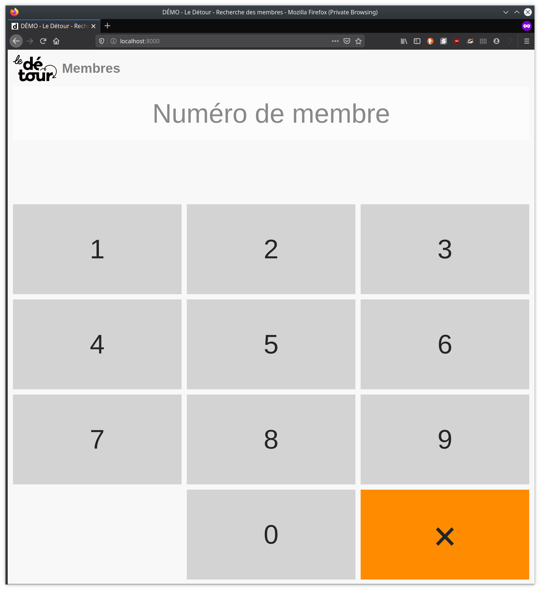

# Member page

***VERY MUCH WIP***

This page allow members to check their activity status by entering their member number ID.



## Data fetch

The WebUI expects a `/members.json` with such a structure:

``` json
{
  "updated_at": "2019-11-01T02:05:45.512Z",
  "members": {
    "333": {
      "active": true,
      "hours_in_bank": 9
    },
    "444": {
      "active": false,
      "hours_in_bank": -3
    },
    "555": {
      "active": true,
      "hours_in_bank": 0
    }
  }
}
```

The scripts `get-members-json.sh` get the values from a Google Spreadsheet and exports
an JSON suitable for the WebUI. Run it like:

``` sh
$ scripts/get-members-json.sh /path/to/final/members.json
```

The script `get-members-json.sh` is ran by the server via a [systemd timer](https://wiki.archlinux.org/index.php/Systemd/Timers) once every hour in order to download an updated copy of `/members.json`.


## Extracting data from Google Spreadsheet

A Google App Script is defined in the [gscript folder](gscript) folder. This script fetches data in the relevant spreadsheet in the Détour Google Drive and serves it in a JSON suitable for consumption by the UI. On production server it is expected that the `/members.json` file is updated on a regular basis by systemd timer, a cron job of anything similar.

## Serve

The page is a static website that can be served with any simple web server. For example, in python 3:

``` bash
$ python3 -m http.server
Serving HTTP on 0.0.0.0 port 8000 (http://0.0.0.0:8000/) ...
```
