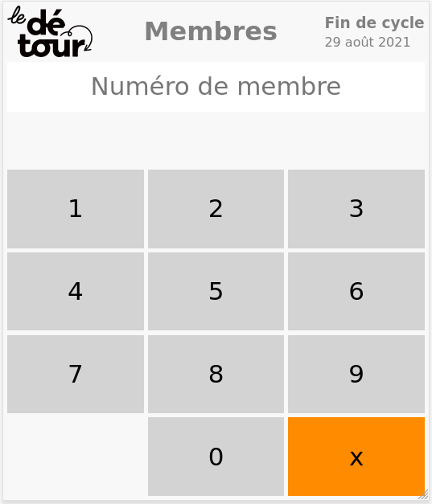

# Members page

This page allow members to check their activity status by entering their member number ID.



## Architecture

### General

This application is a simple static website that reads and display the content of the `/members.json` file. Content of the `/members.json` file varies depending of the source of the request:
- publicly, the json is anonymized and does not contain the contact details attached to a member number
- internaly from Le Détour Point Of Sale, the json is not anonymized but does not contain the number of hours in a member's bank

The script `get-members-json.py` is ran by the server via a [systemd timer](https://wiki.archlinux.org/index.php/Systemd/Timers) once every hour in order to generates the anonymized and non-anonymized members JSON. The script `get-members-json.py` gets its data from the Google Script [gscript/Code.js](gscript/Code.js) and saves a pair of anonymized and non-anonymized JSON to the file system.

Authentification is done by SSL Client Certificates installed on the POS. See the configuration in the [ansible-automation repository](https://github.com/epicerieledetour/ansible-automation/tree/master/roles/nginx-membres/files).


### JSON schemas

#### JSON returned from [`gscript/Code.js`](gscript/Code.js)

```json
{
    "updated_at": "2025-01-21T04:31:33.206Z",
    "cycle_end": "2025-02-09T05:00:00.000Z",
    "members": {
        "2": {
            "active": true,
            "hours_in_bank": 6,
            "family_name": "Dupont",
            "first_name": "Alice",
            "phone": "+514 123 4567"
        },
        "3": {
            "active": false,
            "hours_in_bank": -3,
            "family_name": "Smith",
            "first_name": "Bob",
            "phone": ""
        }
    },
    "source": "https://example.com/google/sheet/source",
    "public_fields": [
        "updated_at",
        "cycle_end",
        "members"
    ],
    "members_public_fields": [
        "active",
        "hours_in_bank"
    ],
    "contains_private_data": true
}
```

#### Non anonymized JSON returned by [`scripts/get-members.json.py`](scripts/get-members.json.py)

This is the same as the JSON returned by [`gscript/Code.js`](gscript/Code.js):

```json
{
    "updated_at": "2025-01-21T04:31:33.206Z",
    "cycle_end": "2025-02-09T05:00:00.000Z",
    "members": {
        "2": {
            "active": true,
            "hours_in_bank": 6,
            "family_name": "Dupont",
            "first_name": "Alice",
            "phone": "+514 123 4567"
        },
        "3": {
            "active": false,
            "hours_in_bank": -3,
            "family_name": "Smith",
            "first_name": "Bob",
            "phone": ""
        }
    },
    "source": "https://example.com/google/sheet/source",
    "public_fields": [
        "updated_at",
        "cycle_end",
        "members"
    ],
    "members_public_fields": [
        "active",
        "hours_in_bank"
    ],
    "contains_private_data": true
}
```

#### Anonymized JSON returned by [`scripts/get-members.json.py`](scripts/get-members.json.py)

```json
{
    "updated_at": "2025-01-21T04:31:33.206Z",
    "cycle_end": "2025-02-09T05:00:00.000Z",
    "members": {
        "2": {
            "active": true,
            "hours_in_bank": 6,
        },
        "3": {
            "active": false,
            "hours_in_bank": -3,
        }
    }
}
```

## Development

### Requirements

This webapp requires [Python 3](https://www.python.org) only for developping. On the server, it requires [nginx](https://nginx.org) and [systemd](https://systemd.io/).

### Local setup

#### Editing and publishing [`gscript/Code.js`](gscript/Code.js)

The published script should be visible from https://script.google.com/home/all when connected with an `@epicerieledetour.org` Google account. However, to ensure the script in this git repository is the source of truth, it is recommenced to:
- edit the script locally first
- then publish it with [clasp](https://developers.google.com/apps-script/guides/clasp) from the [`gscript`](gscript) folder

Once the code is pushed to Google using clasp, the file extensions change from `.js` to `.gs`. The script should always be commited as a `.js`.

To run the app it will require a JSON file to parse in order to display any data. 
  - Copy the data from the live public version of the app by navigating to https://membres.epicerieledetour.org/members.json. 
  - The <code>members.json</code> file must be saved locally in the project's 'src' folder.
- In order to run a local server use python, in the terminal:
<code> python3 -m http.server </code>
- While the server is running you can find the app at <code>localhost:8000</code> in your browser.

#### Generating the anonymized and non-anonymized JSON

The [`scripts/get-members-json.py`](scripts/get-members-json.py) script fetches the JSON generated by [`gscript/Code.js`](gscript/Code.js) and writes an anonymized and a non-anonymized JSON to disk. After `members-anonymized.json` or `members-non-anonymized.json` is generated, symlink either to `src/members.json`.

The script is run as:

```bash

# LDT_MEMBRES_GOOGLE_SCRIPT_URL is a private url that can't be shared
# on this public repo. It is currently stored encrypted in the
# ansible-automation repo, within a vault file.
#
# See the variable `ldtmembres_google_webapp_url` in
# https://github.com/epicerieledetour/ansible-automation/blob/master/group_vars/webservers/vars.yml

$ export LDT_MEMBRES_GOOGLE_SCRIPT_URL=https://example.com/the_gscript/exec
$ export LDT_MEMBRES_ANONYMIZED_PATH=members-anonymized.json
$ export LDT_MEMBRES_NON_ANONYMIZED_PATH=members-non-anonymized.json
$ scripts/get-members-json.sh
```

#### Serve

The page is a static website that can be served by any web server. For example, in Python 3:

``` bash
$ cd src
$ python3 -m http.server
Serving HTTP on 0.0.0.0 port 8000 (http://0.0.0.0:8000/) ...
```
